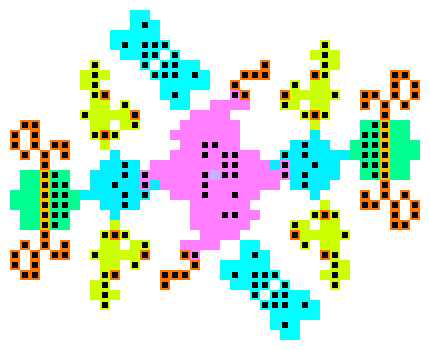

# Oscilloscope

Oscilloscope is an oscillator analyzer for cellular automata.

[https://rei1024.github.io/oscilloscope/](https://rei1024.github.io/oscilloscope/)



## Development

- Node.js v20

Install dependencies

```sh
npm ci
```

Run development server

```sh
npm run dev
```

<http://localhost:5174/oscilloscope>
